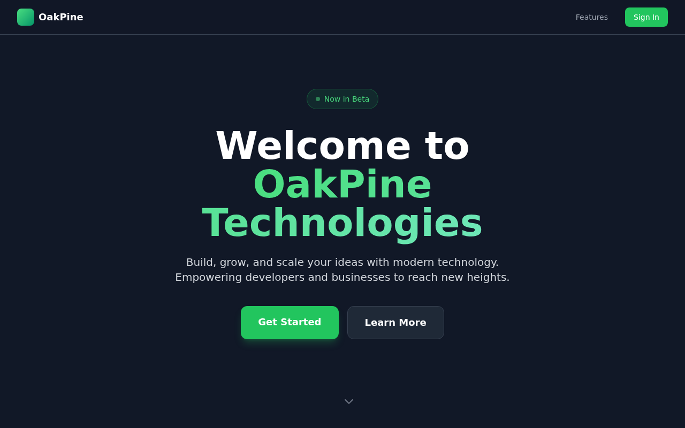

# OakPine Technologies
Official website of oakpine.tech domain

## Website Preview



## Local development

```bash
npm install
npm run dev        # http://localhost:4321
```

## Environment variables

Copy `.env.example` to `.env` and fill in the values before starting the server.

```bash
cp .env.example .env
```

| Variable | Description | Exposed to browser? |
|---|---|---|
| `DATABASE_URL` | Full connection string for PostgreSQL (or MySQL) used to store user accounts and sessions | No |
| `AUTH_SECRET` | Random secret (≥ 32 chars) for signing sessions / JWTs | No |
| `GOOGLE_CLIENT_ID` / `GOOGLE_CLIENT_SECRET` | Google OAuth 2.0 app credentials | No |
| `GITHUB_CLIENT_ID` / `GITHUB_CLIENT_SECRET` | GitHub OAuth app credentials | No |
| `MICROSOFT_CLIENT_ID` / `MICROSOFT_CLIENT_SECRET` | Microsoft / Azure AD app credentials | No |
| `LINKEDIN_CLIENT_ID` / `LINKEDIN_CLIENT_SECRET` | LinkedIn OAuth app credentials | No |
| `TWITTER_CLIENT_ID` / `TWITTER_CLIENT_SECRET` | Twitter / X OAuth 2.0 app credentials | No |
| `APPLE_CLIENT_ID`, `APPLE_TEAM_ID`, `APPLE_KEY_ID`, `APPLE_PRIVATE_KEY_PATH` | Sign in with Apple credentials | No |
| `NEXTCLOUD_WEBDAV_SERVER` | Base URL of your Nextcloud instance (e.g. `https://cloud.example.com`) | **Yes** ⚠ |
| `CNC_APP_USER` / `CNC_APP_PASSWORD` | Nextcloud account used by the CNC app to upload manufactured part files | **Yes** ⚠ |
| `PCB_APP_USER` / `PCB_APP_PASSWORD` | Nextcloud account used by the PCB app to upload board design files | No |

The `.env` file is listed in `.gitignore` and will never be committed to the repository.

> ⚠ **Browser-exposed variables** (`NEXTCLOUD_WEBDAV_SERVER`, `CNC_APP_USER`,
> `CNC_APP_PASSWORD`) are written into `env-config.js` at container/server startup
> and are visible to anyone who opens the page. Use a dedicated per-application
> Nextcloud token (not an admin password) and keep the Nextcloud instance
> behind its own authentication. For a higher-security deployment, proxy the
> WebDAV calls through a server-side route (`@astrojs/node` + `nginx proxy_pass`)
> so credentials never reach the browser.

## Next steps – enabling social logins

The login page already renders the provider buttons.  
Wiring them up end-to-end requires the following steps:

1. **Switch to SSR** – add `@astrojs/node` (or another server adapter) so the site
   can handle dynamic `/auth/*` routes:
   ```bash
   npx astro add node
   ```
2. **Add an auth library** – [Auth.js](https://authjs.dev) (`@auth/core` +
   `@auth/astro`) is the recommended choice. It supports all six providers already
   listed in `SocialLogin.svelte` and manages the OAuth flow, tokens, and sessions
   out of the box.
3. **Choose a database adapter** – Auth.js ships adapters for Drizzle, Prisma,
   and several managed databases. Connect it to `DATABASE_URL` so that user
   records and sessions are persisted automatically.
4. **Register OAuth apps** – create an OAuth application in each provider's
   developer console (links are in `.env.example`), set the callback URL to
   `https://<your-domain>/auth/callback/<provider>` (replace `<provider>` with
   the lowercase provider name, e.g. `google`, `github`), and copy the
   credentials into your `.env` file. Refer to the
   [Auth.js provider docs](https://authjs.dev/getting-started/providers) for
   the exact callback URL each provider expects.
5. **Configure Auth.js** – create `src/auth.ts` that instantiates `Auth` with
   the desired providers and the database adapter, then expose the `/auth/*`
   catch-all route in Astro.
6. **Protect pages** – use the Auth.js session helpers in Astro frontmatter to
   redirect unauthenticated users back to `/login`.
7. **Deploy** – pass the `.env` values to your hosting platform (Docker env vars,
   platform secrets, etc.) so the production server can reach the database and
   OAuth providers.

## Production deployment

### Node.js version

Astro 5 requires **Node.js ≥ 18.17.1**.  
From the available versions, the minimum supported release is **18.20.8**.  
Recommended: use the latest LTS release (**20.20.0** or newer).

### Deploy without Docker

1. Install dependencies and build the static site:
   ```bash
   npm install
   npm run build        # outputs to dist/
   ```

2. Generate `env-config.js` with your runtime configuration:
   ```bash
   export NEXTCLOUD_WEBDAV_SERVER=https://cloud.example.com
   export CNC_APP_USER=cnc_user
   export CNC_APP_PASSWORD=cnc_password
   # Or source a .env file:  set -a && . .env && set +a
   ./scripts/gen-env-config.sh          # writes dist/env-config.js
   ```
   Re-run this script whenever environment values change (no rebuild needed).

3. Copy the `dist/` directory to your web server's root and serve it as a
   static site.  
   Using the built-in Astro preview server (for smoke-testing only – not
   recommended for high-traffic production):
   ```bash
   npm run preview      # http://localhost:4321
   ```
   For a real production server use nginx, Apache, Caddy, or a dedicated
   static-file server such as [serve](https://github.com/vercel/serve):
   ```bash
   npx serve dist       # http://localhost:3000
   ```

4. If you later change any environment variables, re-run
   `scripts/gen-env-config.sh` (pointing `WEBROOT` at your nginx html
   directory) and reload nginx — no rebuild or redeployment of the static
   files is required:
   ```bash
   WEBROOT=/usr/share/nginx/html ./scripts/gen-env-config.sh
   nginx -s reload
   ```

## Docker – build & run locally

The `Dockerfile` compiles the site and serves it with nginx.  
The port defaults to **8080** and can be changed at build time.  
Runtime environment variables are injected via `docker-entrypoint.sh`, which
writes `env-config.js` before nginx starts — no rebuild required to change config.

```bash
# Build (default port 8080)
docker build -t oakpine-tech .

# Run with environment variables — visit http://localhost:8080
docker run --rm -p 8080:8080 \
  -e NEXTCLOUD_WEBDAV_SERVER=https://cloud.example.com \
  -e CNC_APP_USER=cnc_user \
  -e CNC_APP_PASSWORD=cnc_password \
  oakpine-tech

# Or pass all variables from a .env file
docker run --rm -p 8080:8080 --env-file .env oakpine-tech

# Use a different port (e.g. 3000)
docker build --build-arg PORT=3000 -t oakpine-tech .
docker run --rm -p 3000:3000 --env-file .env oakpine-tech
```

## Docker – export dist/ for production deployment

To produce a local `dist/` folder (identical to `npm run build`) without
installing Node.js on the host, use the dedicated `export` stage together with
Docker BuildKit's `--output` flag:

```bash
DOCKER_BUILDKIT=1 docker build --target export --output type=local,dest=./dist .
```

This writes the compiled static files into `./dist/` on your machine.  
You can then copy that directory to any web server (nginx, Apache, Caddy, etc.)
or deploy it to a static hosting service.
